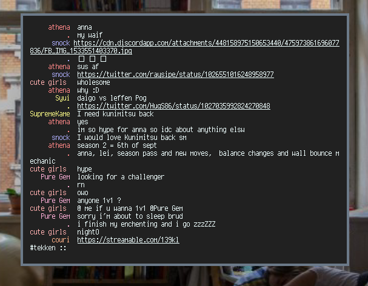

# Terminal-Discord

A simple terminal based client for Discord using the [discord.js](https://discord.js.org) API.

If you have any questions feel free to join this [server](https://discord.gg/ZBX4Xyh). 

## Installation
Clone the repository to a directory of your choice.
Find your token and add it to the config file.
Run sudo ./install.sh

## Config-File

The default locations for the config file are ~/.config/terminal-discord or ~/.terminal-discord. It is however also possible to pass a path to a config file like such

$terminal-discord PATH\_TO\_CONFIG

All settings except Token are optional. Defaults can be found at the beginning of index.js where the config-file is parsed.

### Token

Terminal-Discord uses a token to login rather than email and password since discord.js doesn't support that method anymore.
To retrieve your token open up your Discord client and press Ctrl-Shift-I. Navigate to the Application tab and find the token in the local storage.

### MaxNameLength

The maximum length of usernames. If the value is null usernames are not cut short.

### allign

If set to false the seperators will be displayed right after the username instead of them being alligned with other seperators.

### Seperator

Seperator between username and message content.

### HistoryLength

Number of messages loaded at a time. If set to null will fetch as many messages as there are rows in the current terminal window.

### defaultGuild

If not null this corresponds to the index of the guild you want selected at startup.

### defaultChannel
If not null this corresponds to the index of the channel you want selected at startup.

If the item is on the first page of the selection interface then the index is

*displayed\_number -1*

If the item is on another page then the index is

*displayed\_number -2 + (page\_number - 1) * 8*

For example if the guild is the 5th option on the 2nd page the index corresponds to 

*(5 - 2) + (2 - 1) * 8 = 11*

and if the channel is the 3rd option on the 2nd page the channel index should be

*(3 - 2) + (2 - 1) * 8 = 9*

### prompt
The prompt used.

### displayuser
Wether the username should be displayed in front of the prompt.

### colorsupport
Wether color for usernames is enabled or not.

### defaultColor
Default color for users without a role. If not set will default to #FFFFFF.

### mentionColor
What background color the message should have when you get mentioned. Only applicable when colorsupport is enabled. Setting this to null disables the feature.

### usenick
Wether the nickname should be displayed when available.

### time
Show the timestamp next to a message.

### date
Enable date support to display DD.MM.YYYY in front of the time.

## Commands

Enter a command while in a channel using /.

__q__ or __quit__: exits the client

__u__, __update__, __r__, __refresh__: refreshes manually

__nick__: changes your nickname

__d__, __delete__: deletes the last sent message

__e__, __edit__: replace the content of your last sent message with the string after /e

__m__, __menu__: open the channel selection menu to switch to a different channel

__o__, __online__: show a list of currently online users

__g__, __gr__, __group__: open group chat selection menu to switch to a different channel

__dm__, __pm__: open dm chat selection menu to switch to a different channel

Note that edit and delete only work on messages sent in the current session. If you haven't sent a message in the current session the command will do nothing.
