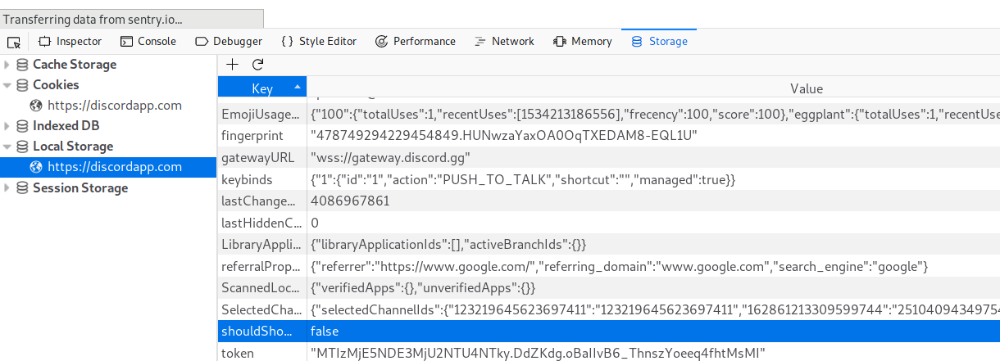

# Terminal-Discord

A simple terminal based client for Discord using the [discord.js](https://discord.js.org) API.

If you have any questions feel free to join this [server](https://discord.gg/ZBX4Xyh). 

## Installation
Clone the repository to a directory of your choice.
Find your token and add it to the config file.
Run sudo ./install.sh

## Config-File

The default locations for the config file are ~/.config/terminal-discord or ~/.terminal-discord. It is however also possible to pass a path to a config file like such

$terminal-discord PATH\_TO\_CONFIG

All settings except Token are optional. Defaults can be found at the beginning of index.js where the config-file is parsed.

Check the example config in the repository for an example.

### token

Discord has made token retrieval more difficult after recent updates. To find your token you have to navigate to the discord browser site, open the developer tools with ctrl+shift+i or similar and find the local storage as shown in the picture.

Once you reload the page the token will pop up for about a second. Copy it and paste it in the config-file.

### max_name_length

The maximum length of usernames. If the value is null usernames are not cut short.

### allign

If set to false the seperators will be displayed right after the username instead of them being alligned with other seperators.

### separator

Separator between username and message content.

### history_length

Number of messages loaded at a time. If set to null will fetch as many messages as there are rows in the current terminal window.

### default_guild

If not null this corresponds to the index of the guild you want selected at startup.

### default_channel
If not null this corresponds to the index of the channel you want selected at startup.

To get the indices for both guild and channel navigate to your channel and use the /info command.

### prompt
The prompt used.

### color_support
Wether color for usernames is enabled or not.

### default_color
Default color for users without a role. If not set will default to #FFFFFF.

### mention_color
What background color the message should have when you get mentioned. Only applicable when colorsupport is enabled. Setting this to null disables the feature.

### use_nickname
Whether the nickname should be displayed when available.

### show_time
Show the timestamp next to a message.

### show_date
Enable date support to display DD.MM.YYYY in front of the time.

## Commands

Enter a command while in a channel using /.

__q__ or __quit__: exits the client

__u__, __update__, __r__, __refresh__: refreshes manually

__nick__: changes your nickname

__d__, __delete__: deletes the last sent message

__e__, __edit__: replace the content of your last sent message with the string after /e

__m__, __menu__: open the channel selection menu to switch to a different channel

__o__, __online__: show a list of currently online users

__g__, __gr__, __group__: open group chat selection menu to switch to a different channel

__dm__, __pm__: open dm chat selection menu to switch to a different channel

__i__, __info__: display basic information about the channel including indices

Note that edit and delete only work on messages sent in the current session. If you haven't sent a message in the current session the command will do nothing.
